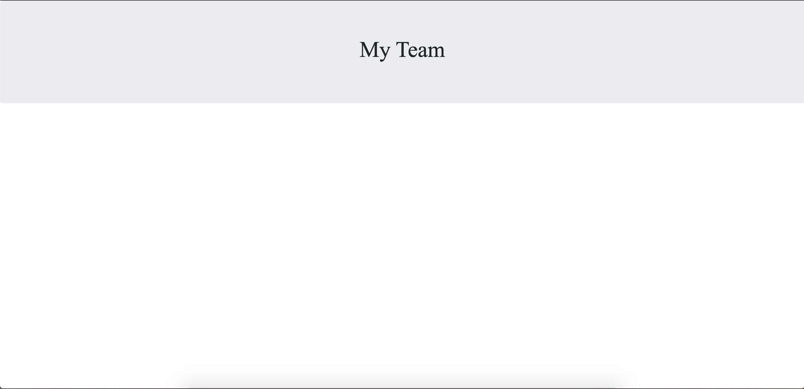
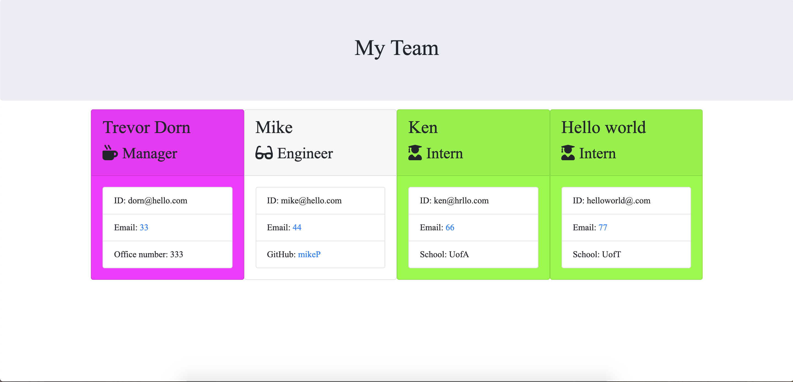

# Template Engine Employee

In this project I created a employee team generator that allows you to put new employees on a team website

### User Story:

```
As a manager
I want to generate a webpage that displays my team's basic info
so that I have quick access to emails and GitHub profiles
```

* Fuschia: Manager
* Grey: Engineer
* Green: Intern

<br>

The following image displays the start page:



<br>

#### Generated: 


<br>

Here's the link: [Click Me](https://dorntrevor7.github.io/template-engine-employee/output/team.html)

